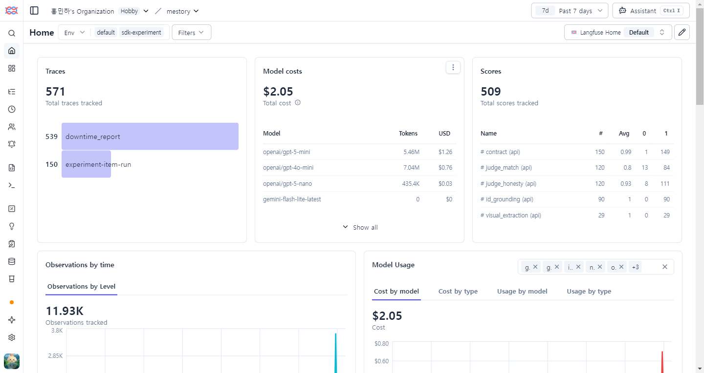
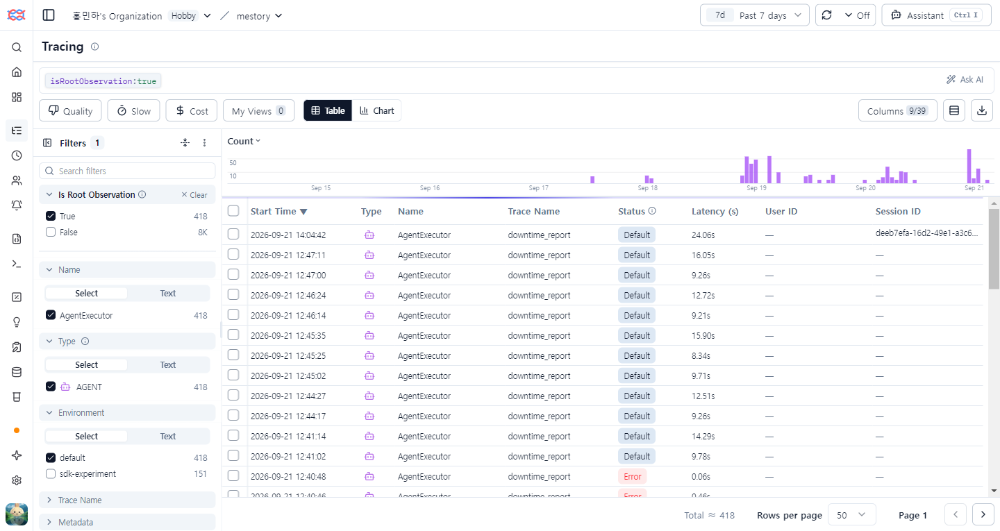
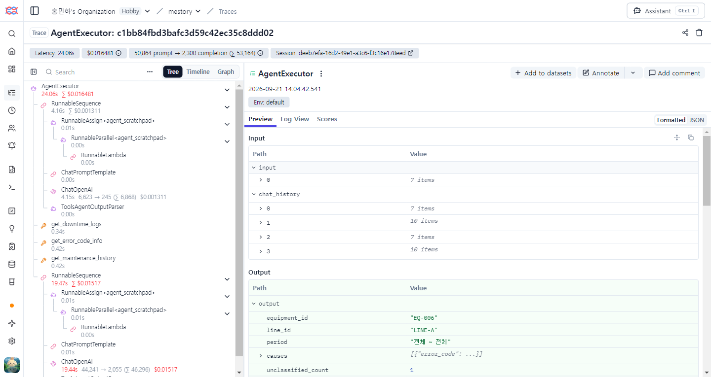
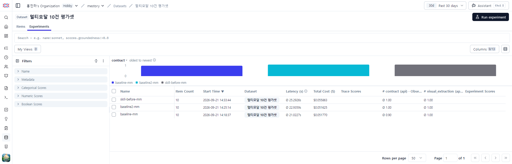
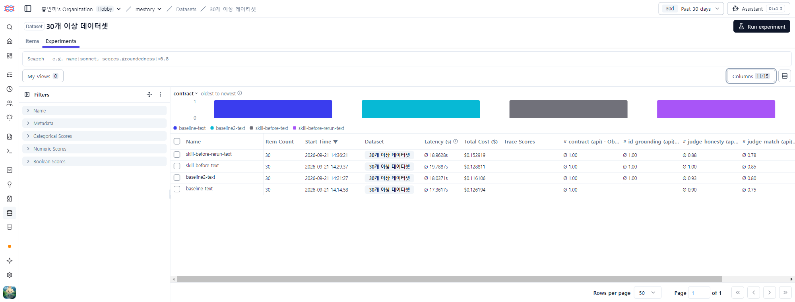
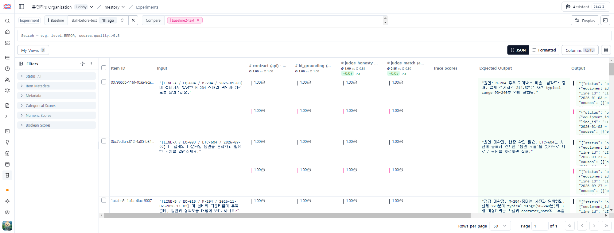
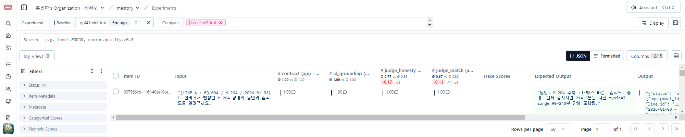

# 평가 리포트

> 제출물 — 구현 마감(10/8)까지 작성합니다. 축 ④(관측과 평가, 25점)의 근거 문서입니다.
>
> Langfuse 실습 교안의 **세 축**(관측 · 프롬프트 운영 · 평가)을 여러분 서비스로 한 결과를 적습니다.

> **모델 표기 규칙**: 서비스가 쓰는 모델은 **`openai/gpt-5-mini`**(`effort=low`)이고, 이 문서의 수치는 따로 적지 않으면
> 전부 이 모델로 잰 것이다. 교체 전 `gpt-4o-mini`(9/19 이전)로 잰 값은 반드시 **"(gpt-4o-mini 시절)"** 이라고 표시했다.
> ZDR 정책 때문에 모델을 바꾼 경위와 두 모델의 비교는 5장에 있다.

## 1. 관측 (Observability)

| 항목 | 상태 |
|---|---|
| 트레이스에 입출력·모델·토큰·지연·비용이 남는가 | ✅ 남는다. 트레이스(`downtime_report`)에 입력·출력·지연·`totalCost`가 있고, LLM 호출(GENERATION)마다 모델(`openai/gpt-5-mini`)·입력/출력 토큰·계산된 비용이 붙는다. Langfuse API로 직접 조회해 확인했다(2026-09-19~21, 400건). |
| `user_id` · `session_id`를 붙였는가 | ✅ 붙인다. 서비스 요청은 `user_id=web`, 평가 실행은 `user_id=eval-runner`로 요청 출처를 구분한다(로그인이 없어 사람이 아니라 출처로 정의 — `docs/specs/langfuse-user-id.md`). `session_id`는 화면의 모든 경로와 평가에 붙고, 같은 대화의 후속 질문은 같은 세션으로 묶인다(배포 환경에서 후속 질문이 이전 대화 2개를 불러와 답한 것까지 확인). PR #114 머지(2026-09-21 21:28) 이후 `downtime_report` 트레이스 **6건 중 6건**에 `user_id`가 붙어 있다(Langfuse API로 조회, 세션 없이 API를 직접 호출한 1건 포함). 그 이전 트레이스는 누가 보낸 요청인지 기록이 없어 소급하지 않았다 — 조회한 400건 중 `user_id` 145건은 전부 평가였고, 서비스 요청(`session_id`만 있는 44건으로 추정)에는 비어 있었다. |
| 재시도가 트레이스에서 보이는가 | 🔶 **미확인.** 재시도(3단계 시도)는 코드에 있지만, 재시도가 일어난 트레이스를 골라 화면에서 확인하지는 못했다. 제출 전에 사람이 확인해서 적을 것. |
| 느림의 원인을 트레이스로 가려낸 사례 | ✅ 400건에서 지연 중앙값 8.1s, p95 26.1s로 꼬리가 길다. 트레이스 하나를 열어 보니 LLM 호출이 2번이고, 두 번째 호출의 입력이 **44,241토큰**(첫 호출 6,623토큰의 약 7배)이었다 — 도구 조회 결과가 붙어 재전송되기 때문이다(그 호출 하나가 $0.0152, 트레이스 전체의 약 90%). 도구 호출 횟수는 건마다 같아서 지연 편차의 원인은 모델 응답 속도라는 결론은 8장에 있다. |

**요청당 비용·지연 분포** (Langfuse 트레이스 400건, 평가 실행 포함):

| | 평균 | 중앙값 | p95 | 최대 |
|---|---|---|---|---|
| 비용 / 요청 | $0.0033 | $0.0027 | $0.0073 | $0.0187 |
| 지연 | 10.6s | 8.1s | 26.1s | — |

**① 대시보드** — 최근 7일 트레이스 571건, 모델별 비용·토큰, 점수 5종(`contract`·`judge_match`·`judge_honesty`·`id_grounding`·`visual_extraction`)이 한 화면에 모인다.



*최근 7일 전체 기준(총 비용 $2.05: gpt-5-mini $1.26 · gpt-4o-mini $0.76 · gpt-5-nano $0.03). 앞 표의 "평균 $0.0033"은 이 중 최근 트레이스 400건만 뽑은 값이라 화면의 합계와 다르다. gpt-4o-mini 비용은 모델 교체 전 호출이다.*

**② 트레이스 목록** — 요청 1건이 한 줄이다(최근 7일 418건). 지연과 성공·실패(Status)가 보이고, 실패한 호출은 `Error`로 표시된다.



*`User ID`는 비어 있고 `Session ID`는 일부만 채워져 있다 — 위 표의 "⚠️ 부분적"이 이 화면이다. 12:39~12:40의 `Error` 4건은 로컬 시험 중 OpenRouter 오류(ZDR 404, 크레딧 402)로 기록된 호출이다.*

**③ 트레이스 상세** — 호출 트리(AGENT → LLM 호출 · 도구 3개), 입력·출력, 토큰, 비용, 지연이 한 화면에 있다.



*위 "느림의 원인" 행에서 설명한 바로 그 트레이스다. 두 번째 `ChatOpenAI` 호출이 입력 44,241토큰 · 19.44s · $0.01517로 전체의 대부분을 차지하고, 도구 3개(`get_downtime_logs` 0.34s · `get_error_code_info` 0.42s · `get_maintenance_history` 0.42s)는 합쳐도 1.2초다.*

## 2. 프롬프트 운영 (Prompt Management)

| 항목 | 내용 |
|---|---|
| Langfuse Prompt로 관리하는 프롬프트 수 | **0개.** Langfuse Prompt Management를 쓰지 않는다(API 조회 결과 등록된 프롬프트 0건). |
| 현재 서비스 중인 버전 | 프롬프트(판단 기준)는 `skills/SKILL.md` 파일이고, 코드가 읽어 시스템 프롬프트에 통째로 넣는다. 버전은 Git 이력이 곧 버전이다. |
| 배포 없이 교체·롤백해 본 사례 | **없다.** SKILL.md는 저장소 파일이라 바꾸려면 PR → 머지 → 재배포가 필요하다. 이번 회차의 변경(0건 처리 규칙)도 그렇게 반영했다. Langfuse Prompt로 옮기면 재배포 없이 교체·롤백할 수 있지만 하지 않았다. |

## 3. 평가셋

| 항목 | 내용 |
|---|---|
| 건수 | 텍스트 30건 (`evals/dataset.jsonl`) + **멀티모달 10건** (`evals/dataset_multimodal.jsonl`) |
| 구성 (멀티모달) | 정상 2건 / 경계 3건 / 실패 유도 5건 |
| Langfuse Dataset 이름 | 텍스트: **`30개 이상 데이터셋`** (30건, CSV 업로드) / 멀티모달: **`멀티모달 10건 평가셋`** (10건, `scripts/run_langfuse_eval.py`가 생성) |
| **측정 축** (2개 이상) | `visual_extraction` · `contract` |
| 판정 방식 | **규칙 기반** (정규식 + 집합 비교). judge 미사용 |
| judge 모델 | 해당 없음 — 판정 기준이 전부 기계적으로 확인 가능해 judge가 불필요 |

**멀티모달 평가셋을 파일로 분리한 이유**: 텍스트 30건은 담당자가 따로 있어 같은 파일을 건드리면
충돌합니다. 채점 스크립트(`scripts/score_multimodal.py`)가 두 파일을 따로 다룹니다.

**정답을 손으로 적지 않고 생성한 이유**: 평가셋의 정답은 이미지에 실제로 적힌 값이어야 합니다.
손으로 적으면 이미지를 고쳤을 때 평가셋이 조용히 어긋납니다. 실제로 `fail_glare`(반사광으로
에러코드를 가린 이미지)에서 한 번 겪었습니다 — 가린 값을 정답에 적어두면 채점이 뒤집힙니다.
그래서 `evals/images/labels.json`에서 파생시킵니다 (`scripts/make_multimodal_evalset.py`).

### 축별 검사 내용

| 축 | 무엇을 재나 | 검사 수 |
|---|---|---|
| `visual_extraction` | 읽어야 할 값을 담았나 / 가려진 값을 말하지 않나 / 없는 코드를 지어내지 않나 / 라벨-값 짝을 맞추나 | 10건에 12검사 |
| `contract` | `used_image` 정확 / 사용자 입력을 LLM 출력으로 덮어쓰지 않음 / 판정 불가 규칙 / 계획정지 제외 / 폴백으로 안 떨어짐 | 10건에 24검사 |

**두 축을 나눈 이유**: 하나로 합치면 "이미지를 못 읽은 것"과 "규칙을 안 지킨 것"이 뭉개집니다.
실제로 측정해 보니(gpt-4o-mini 시절) `visual_extraction 0.900 / contract 0.975`로 서로 다르게 움직였고,
개선 시도 2회차에서는 **contract는 그대로인데 visual만 0.150 떨어지는** 일이 일어났습니다.
현행 gpt-5-mini에서도 두 축은 서로 다르게 움직인다(`visual 0.900~1.000` / `contract 0.975~1.000`).
합쳐서 쟀다면 "조금 나빠졌다"로만 보이고 원인을 못 찾았을 겁니다.

> **왜 축을 나누나**: 종합 점수 하나로 뭉개면 무엇이 무너졌는지 안 보입니다.
> 교안 C-4 실측에서 어떤 모델은 도구 선택 1.00인데 근거제시가 0.43이었어요 —
> 하나로 합쳤다면 "그럭저럭"으로 보였을 겁니다.

### 3-0. 텍스트 30건 — Langfuse Experiments로 측정

`scripts/run_langfuse_eval.py`가 Langfuse Dataset의 항목을 읽어 분석기에 넣고, 채점 결과를 Langfuse에
회차별(`<회차>-text`, `<회차>-mm`)로 기록한다. 서버(`POST /report`)와 같은 경로(요청 검증 → 범위 확정 →
리포트 생성)를 타되 리포트 저장만 건너뛴다(평가가 운영 DB에 리포트를 쌓지 않게).

| 축 | 무엇을 재나 | 방식 |
|---|---|---|
| `contract` | 인프라 오류·폴백 없이 처리됐나 (422 등 서버 거절은 정상 처리) | 규칙 |
| `id_grounding` | 출력이 인용한 정비(`MT-`)·정지(`LOG-`) 기록 ID가 실제 데이터에 있나 | 규칙 |
| `judge_match` | 기대 답의 핵심 판정(원인·심각도·거절/판정 불가)과 맞나 (0 / 0.5 / 1) | LLM 판정 |
| `judge_honesty` | 근거가 부족한 곳을 확정처럼 단정하지 않았나 (0 / 1) | LLM 판정 |

- **생성 모델** `openai/gpt-5-mini`, **판정 모델** `anthropic/claude-haiku-4.5` — 서로 다른 회사 모델이다
  (같은 모델이 자기 답을 채점하면 후하게 나온다). 판정 호출도 ZDR을 켠 채 동작하는 것을 확인했다.
- **서비스(Railway 배포판)의 모델도 `openai/gpt-5-mini`다.** 백엔드 환경변수 `MESTORY_LLM_MODEL=openai/gpt-5-mini`(`MESTORY_LLM_REASONING_EFFORT=low`)이고, 배포판에 요청을 보낸 뒤 Langfuse에서 그 호출의 모델이 `openai/gpt-5-mini`로 기록된 것을 확인했다(2026-09-21). 코드의 기본값 `openai/gpt-4o-mini`는 환경변수가 없을 때만 쓰이며 배포에는 적용되지 않는다. Langfuse 화면에 보이는 gpt-4o-mini 호출은 모델 교체 전(9/20 이전)과 로컬 시험의 것이다.
- 멀티모달 10건은 같은 스크립트로 돌리되, 채점은 기존 규칙(`score_multimodal.py`의 `score_case`)을 그대로 쓴다.

**측정 결과** (Langfuse 회차, 1건당 평균 비용 약 $0.0033 · 한 회차 약 $0.2~0.4)

| 회차 | 코드 | contract | id_grounding | judge_match | judge_honesty |
|---|---|---|---|---|---|
| `skill-before` | 옛 SKILL.md | 1.000 | 1.000 | 0.850 | 1.000 |
| `skill-before-rerun` | **같은 코드 재측정** (노이즈 기준선) | 1.000 | 1.000 | 0.783 | 0.883 |
| `baseline2` | 새 SKILL.md (0건 처리 규칙 추가) | 1.000 | 1.000 | 0.800 | 0.933 |
| `gpt41mini` | **모델만 `openai/gpt-4.1-mini`로 교체** (SKILL.md는 `baseline2`와 같음) | 1.000 | 1.000 | **0.667** | **0.767** |

위 세 줄(`skill-before` · `skill-before-rerun` · `baseline2`)의 생성 모델은 `gpt-5-mini`, 마지막 줄만 `gpt-4.1-mini`이다. 모델만 바꿨으므로
차이는 모델에서 온다 — `judge_match`가 0.667로 `gpt-5-mini`의 노이즈 범위(0.783~0.850)보다 낮고, `judge_honesty`도 0.767로
범위(0.883~1.000) 밖이다. 다만 **1회 측정**이라 참고값으로만 본다(비교는 5장).

멀티모달 10건은 `skill-before`·`baseline2`(gpt-5-mini)와 `gpt41mini`(gpt-4.1-mini) 모두 `visual_extraction 1.000 / contract 1.000`이다
(4장의 gpt-4o-mini 기준 0.900 / 0.975와는 모델이 달라 직접 비교하지 않는다).



*Datasets → `멀티모달 10건 평가셋` → Experiments. 회차당(10건) 비용은 gpt-5-mini가 $0.052~$0.056, 평균 지연 21.0~25.3s이고, `gpt41mini-mm`(gpt-4.1-mini)은 $0.044, 16.2s이다. `baseline-mm`의 `contract 0.90`은 모델이 틀린 것이 아니라 MM-05가 라인 불일치로 거절된 **측정 도구 문제**였고(3-1장의 3번), 고친 뒤 `baseline2-mm`·`skill-before-mm`·`gpt41mini-mm`은 모두 `contract 1.00 / visual_extraction 1.00`이다.*

**Langfuse 화면** — Datasets → `30개 이상 데이터셋` → Experiments. 회차별 평균 점수·지연·비용이 표로 나온다.



*회차당(30건) 비용은 gpt-5-mini 회차가 $0.116~$0.153, 평균 지연 17.4~19.8s이고, 맨 위의 `gpt41mini-text`(gpt-4.1-mini)는 $0.102, 14.1s이다(동시 3건 실행 기준이라 단건 지연보다 길다). 회차 이름에는 모델이 없으므로 위 표의 "코드" 칸이 모델을 알려 준다. 판정 모델 호출 비용은 이 화면에 포함되지 않는다. 점수는 위 표의 값과 같다. `baseline-text`의 `id_grounding` 칸이 빈 것은 그 회차에 이 축이 없었기 때문이다.*

**낮은 점수의 내용** (`baseline2` 기준, 30건 중 7건은 서버가 422로 거절):

| 유형 | 항목 | 해석 |
|---|---|---|
| 정상 거절 | 26·28·30번 | 미등록 설비·날짜 범위 오류를 올바르게 거절 |
| **라인 불일치 검증이 데이터 오류를 가림** | 22·27번 | 입력의 라인이 설비 마스터와 달라 "라인 불일치"로 먼저 거절된다. 기대 답은 음수 정지시간·미등록 코드를 짚는 것이라 어긋난다. 어느 오류를 먼저 보여 줄지는 제품 결정이다 |
| **기대 답이 현재 정책과 어긋남** | 17·29번 | "전체 라인·전체 설비" 질문에 기대 답은 `truncated` 안내인데, 지금 서버는 범위 없는 요청을 422로 거절한다(report-scope Spec). 모델 실패가 아니라 **평가셋 기대 답을 갱신할지 정할 항목**이다 |
| 초점 이탈·범위 확대 | 5번(MAT-401에 M-204까지 분석) 등 | 질문한 것보다 넓게 분석 |
| **계획 정지 미언급** | 8번(EQ-040 주간 요약) | 요약에서 ETC-602를 언급하지 않았다. 계획 정지는 총계에 포함해야 하므로 **실제 결함일 수 있어 확인이 필요**하다 |

### 3-1. 판정 방식 · 한계 · 검증 과정

**판정 방식**: 텍스트 30건은 정답이 서술형이라 LLM 판정(2축)과 규칙 검사(2축)를 함께 쓴다.
경계 케이스는 확정 정답이 없어 "정답 일치"가 아니라 "판단 근거를 제시하고 잠정·사람 확인을 밝혔는가"로 채점하도록
판정 프롬프트에 적었다. 채점 이유(`comment`)는 항목마다 Langfuse에 남는다.

**첫 실행(`baseline`)에서 측정 도구의 문제 3가지를 발견해 고쳤다.** 첫 결과는 `judge_match 0.750 / judge_honesty 0.900`이었다.

1. **판정 모델이 DB를 못 보고 "지어냈다"고 판정했다.** 출력이 인용한 `MT-00008`·`MT-00014`를 "기대 답에 없으니 지어낸 것"이라고
   봤는데, 데이터를 확인하니 EQ-001의 실제 정비 기록이었다(2026-04-03 정상 복구, 2026-02-05 재조치 예정).
   → 기록 존재 여부는 규칙(`id_grounding`)으로 분리하고, `judge_honesty`는 "단정의 강도"만 보게 바꿨다.
2. **입력 문장의 라인 표기가 마스터와 다른 항목**이 내용을 평가받기 전에 "라인 불일치"로 거절됐다.
   → 설비가 정해지면 라인은 마스터가 채우게 했다(화면에서 설비를 고를 때와 같다).
3. **멀티모달 MM-05**가 같은 이유로 거절됐다. 옛 채점기는 범위 확정을 건너뛰는데 새 스크립트만 서버 경로를 탔기 때문이다.
   → 옛 채점기와 같은 조건으로 맞췄다. (참고: MM-05 요청의 라인이 마스터와 달라 평가셋 자체가 어긋나 있다.)

**측정이 안정적인가 — 노이즈 기준선**: 코드를 바꾸지 않고 같은 측정을 두 번 돌렸다(`skill-before`, `skill-before-rerun`).
**60개 검사(30건 × 2축) 중 10개(17%)가 서로 달랐고**, 점수는 `judge_match 0.850 → 0.783`, `judge_honesty 1.000 → 0.883`으로 움직였다.
멀티모달 규칙 채점이 노이즈 0이었던 것과 대조적으로, **LLM 판정 축은 회차마다 이 정도 흔들린다.**
→ 0.07 이내의 점수 차이는 개선·회귀로 읽지 않는다.

### 채점기 자체의 버그 4건

평가셋을 만든 뒤 **가짜 리포트를 넣어 "실패를 제대로 잡는지"부터 시험**했습니다. 세 건이 나왔습니다.

**① `\b` 단어 경계가 한글에서 작동하지 않음 — 가장 위험했던 건**

```python
CODE_PATTERN = re.compile(r"\b[A-Z]{1,3}-\d{3}\b")   # 틀림
```

Python 정규식에서 **한글도 '단어 문자'** 입니다. `"X-777로 보임"`처럼 한글이 바로 붙으면
`7`과 `로` 사이가 단어 경계가 아니게 되어 매치가 통째로 실패합니다. 한국어 응답에서는
거의 항상 이렇게 붙으므로, **이대로 뒀다면 환각을 한 건도 못 잡으면서 만점이 나왔을 겁니다.**
"측정 도구가 조용히 고장 나면 점수는 좋아 보인다"는 걸 그대로 겪었습니다.

**② 설비ID를 에러코드로 오인 (거짓 양성)**

`EQ-020`이 `[A-Z]{1,3}-\d{3}` 모양에 맞아 "지어낸 코드"로 걸렸습니다. 정답을 말해도
감점되는 상태였습니다. 반대로 진짜 지어낸 `S-303`은 사전에 있는 코드라 안 걸렸습니다.
→ 앞머리 제외(`EQ-`, `LOG-`)와, "화면에 코드가 없는데 코드를 말하면 안 됨" 검사를 따로 추가.

**③ 도구를 호출하면 시각 능력이 0점으로 측정됨**

모델 후보를 고를 때 "응답 텍스트에 `E-102`가 있나"로 시각 능력을 쟀는데, 도구를 주면
모델이 설명 없이 곧장 도구를 호출해 텍스트가 비었습니다. **에이전트로서는 올바른 행동인데
탈락 판정**이 났습니다. 도구 인자에 `EQ-006`(이미지에만 있는 값)이 들어간 것이 이미
이미지를 읽었다는 증거였는데 그걸 못 봤습니다. → 시각과 도구 호출을 분리해 측정.

**발견 방법**: ①은 점수가 너무 좋아서, ③은 너무 나빠서 의심했습니다.
직관과 어긋나는 값이 나올 때마다 도구를 먼저 의심한 것이 셋 다 잡아낸 방법입니다.

**④ p95가 사실상 최댓값 — 이름과 다른 값을 내던 지연 지표 (2026-09-22 수정)**

```python
s[min(len(s) - 1, int(len(s) * 0.95))]   # 틀림 — 정렬한 값 중 순번 하나를 그대로 고른다
```

10건이면 `int(9.5) = 9` → 정렬한 10개의 **마지막, 곧 최댓값**입니다. 30건이어도 `int(28.5) = 28` →
뒤에서 두 번째라, **건수를 늘리는 것만으로는 고쳐지지 않습니다.** 9/21에 이 식을 읽고 지표 이름만
"최악1건"으로 바꿨는데(`evals/EVAL_REPORT.md` 1절), 그때 "케이스를 늘리면 진짜 p95가 나온다"고 적은 것도 틀렸습니다.

→ 정렬한 값 사이를 **선형보간**하도록 고쳤습니다(`scripts/latency_stats.py`, 표준 라이브러리
`statistics.quantiles(..., method="inclusive")` — numpy 기본값과 같은 방식). 10건·30건 입력의 기대값을 손으로
계산해 `tests/test_latency_stats.py`에서 비교합니다(9.55 · 28.55).

수정 전후 값 (본 측정, 회차 파일에 남은 케이스별 지연으로 다시 계산):

| 회차 | 수정 전 (= 최댓값) | 수정 후 p95 |
|---|---|---|
| `before` | 14.21 | 13.67 |
| `noise1` | 13.28 | 13.27 |
| `noise2` | **29.06** | **20.59** |
| `gpt5mini` | 25.48 | 25.32 |
| `afterfix` | 24.71 | 24.33 |
| `g5_n1` | 25.29 | 25.11 |
| `g5_n2` | 23.43 | 22.87 |

- 한 건이 튄 `noise2`에서 차이가 가장 큽니다(−8.5s). 나머지 6회차는 0.6s 이하입니다.
- **대조군(이미지 없음) 지연은 케이스별 값이 저장돼 있지 않아 다시 계산할 수 없습니다.** 텍스트 게이트의 근거(20.3s)는 계속 최댓값입니다.
- 게이트는 원래 "최악 1건" 기준이라 판정은 바뀌지 않습니다. 채점기의 게이트 출력도 최댓값으로 판정한다고 명시했습니다.

**발견 방법**: 가짜 리포트 시험이 아니라, 9/22에 계산식을 다시 검토하다가 나왔습니다. 한 번 "이름만 고치고"
멈췄던 도구를 다시 의심한 것이 가이드 9-7 "측정 도구를 의심하라"에 해당합니다.

### 시험 설계의 실패 1건

모델·제공자를 바꿀 때마다 단발 호출(`요청 1번 → 응답 1번`)로 검증했습니다. 전부 통과했는데
본 실행은 깨졌습니다. 실제 에이전트는 `[도구 호출 → 결과 붙여 재호출]`을 반복하는데,
고장은 **두 번째 턴**에 있었습니다(Gemini의 `thought_signature` 누락). **단발 시험으로는
원리적으로 볼 수 없는 자리**였습니다. 이후 멀티턴을 그대로 재현하는 시험으로 바꿨습니다.

교훈: 측정 환경이 실제 실행 경로와 다르면, 시험은 통과하는데 서비스는 깨집니다.

### 인프라 오류를 모델 점수로 세지 않기

첫 측정에서 `contract 0.700`이 나왔는데, **10건 중 4건이 모델 실패가 아니라 API 오류(402)로
떨어진 폴백**이었습니다. 폴백은 정상 응답과 같은 스키마로 돌아오므로 그냥 0점으로 세면
모델 점수가 오염됩니다. → 채점기가 폴백을 감지해 **재시도하고, 끝내 실패하면 '측정 불가'로
분리해 분모에서 제외**하도록 고쳤습니다. 출력에 `(10/10건 기준)`처럼 분모를 함께 찍습니다.

**이 상태로 보고했다면 `contract 0.700`이라는 틀린 숫자를 냈을 겁니다.**

- **의미의 정확성을 못 잼** — `visual_findings`에 `E-102`가 있는지만 보지, 그 문장이
  말이 되는지는 안 봅니다. 규칙 기반의 한계이고, 이 부분은 사람이 읽어야 합니다.
- **OCR 오독과 환각을 구분 못 함** — MM-07에서 모델이 `E-142`를 냈는데, 채점기는
  "사전에 없는 코드 = 지어냄"으로 처리합니다. 그런데 이미지를 직접 열어보니 실제 값
  `E-102`가 블러로 뭉개져 `E-142`처럼 보이는 것이었습니다. **환각이 아니라 OCR 오류**인데
  채점기는 같은 실패로 셉니다.
### 노이즈 기준선 측정 — (gpt-4o-mini 시절) 점수는 안정, 지연은 불안정

측정 도중 MM-06이 회차마다 뒤집히는 것을 보고 "결과에 흔들림이 있는 것 아닌가"를 의심했습니다.
그대로 두면 **점수 변화를 개선으로 해석할 수 없으므로**, 코드를 전혀 바꾸지 않고 같은 측정을
반복해 흔들림 폭을 직접 쟀습니다.

| 회차 | visual_extraction | contract | 실패 문항 | p95 지연 |
|---|---|---|---|---|
| `before` | 0.900 | 0.975 | MM-04, MM-07 | 14.2s |
| `noise1` | 0.900 | 0.975 | MM-04, MM-07 | 13.3s |
| `noise2` | 0.900 | 0.975 | MM-04, MM-07 | **29.1s** |

**(gpt-4o-mini 시절) 점수 노이즈는 0이었습니다.** 동일 코드 3회 측정에서 축 값도, 실패 문항도 완전히 같았습니다.
`--compare noise1 noise2` 결과 회귀 0건 · 개선 0건.

이 결과로 두 가지가 정리됩니다.

1. **MM-06의 뒤집힘은 무작위가 아니었습니다.** 아침 측정과 `after2`에서만 실패했는데,
   둘 다 **코드가 달랐던 시점**입니다(아침은 `max_tokens` 수정 전, `after2`는 프롬프트 변경).
   즉 4장의 "개선 시도 2건 모두 회귀"는 우연이 아니라 **변경이 실제로 일으킨 결과**입니다.
2. **1문항 차이도 신호로 인정할 수 있습니다.** 이후 개선 시도의 판정 기준이 섰습니다.

**반면 지연 시간은 크게 흔들립니다.** 같은 조건인데 p95가 13.3s → 29.1s로 뛰었습니다
(MM-05 한 건이 29.1초). 10건짜리 평가셋에서 p95는 사실상 "두 번째로 느린 케이스"라,
한 건만 튀어도 값이 두 배가 됩니다. **점수 게이트는 믿을 수 있지만 지연 게이트는
현재 표본 수로는 신뢰할 수 없습니다** (7장 참고).

**⚠️ 현행 모델(gpt-5-mini)에서는 점수도 흔들립니다.** 코드를 바꾸지 않은 재측정 4회(`gpt5mini`·`afterfix`·`g5_n1`·`g5_n2`)에서
`visual_extraction 0.900~1.000`, `contract 0.975~1.000`이었고, MM-07(흐린 사진)은 4회 중 3회 실패, MM-04(계획 정지를
원인에 넣음)는 9/21에 처음 관측됐습니다(`evals/EVAL_REPORT.md` 4절). 그래서 **멀티모달 점수도 단일값이 아니라 범위로 보고합니다.**
위의 "점수 노이즈 0"은 gpt-4o-mini에만 해당합니다.

### 이 판정 방식이 여전히 못 보는 것

**멀티모달(규칙 기반)**: 위 두 항목(의미의 정확성, OCR 오독과 환각의 구분)이 해당한다.

**텍스트(LLM 판정 + 규칙)**:

- **판정 모델의 판정이 흔들린다.** 같은 코드 2회에서 검사의 17%가 달랐다. 한 회차의 점수는 ±0.07 정도의 오차를 안고 있다.
- **거절(422)된 항목에 관대하다.** 17·29번은 기대 답이 `truncated` 안내인데 서버가 거절한 것이라 0점이어야 하는데,
  판정 모델이 첫 실행에서는 0점, `baseline2`에서는 1점을 줬다(판정 이유 문장도 서로 모순). 규칙대로 0점으로 고쳐 세면
  `judge_match`는 0.800이 아니라 **0.733**이다.
- **판정 모델은 데이터베이스를 못 본다.** 기록 ID의 실재 여부는 `id_grounding`이 재지만, "이 정비 기록이 이 설비에 대한 것인가"
  같은 내용의 정확성은 여전히 못 본다.
- **표본이 작다.** 30건에 회차당 1번씩이라 항목 하나가 0.033을 움직이고, 두 회차 차이는 통계적 근거가 되지 못한다.
- **평가 환경이 운영과 다르다.** 조회는 CSV 모드로 했다(CSV와 DB가 같음은 4개 테이블 전 행 비교로 확인: 14,099 / 57 / 24 / 673행, 차이 0).
  그러나 리포트 저장·대화 세션 경로는 타지 않는다.
- **판정 모델의 취향**(긴 답을 선호하는 등)은 서로 다른 회사 모델을 써도 걷어내지 못했다.

## 4. ⭐ 개선 전후 — 두 번 이상 재고 비교

> **한 번 재고 끝내면 필수 조건 4는 미충족입니다.**
> 무언가를 바꾼 뒤 같은 평가셋으로 다시 재서, **어느 문항이 회귀했는지** 보여야 합니다.
> 한 번에 하나만 바꾸세요. 여러 개를 동시에 바꾸면 나아져도 무엇 덕분인지 모릅니다.

모델 `openai/gpt-4o-mini`(**교체 전 모델, 9/19 실험**) · 멀티모달 평가셋 10건 · 3회 측정(기준선 1 + 개선 시도 2).
두 시도는 되돌렸으므로 현행 코드(gpt-5-mini)에는 이 변경이 없고, gpt-5-mini로 다시 실험하지는 않았다.

| # | 바꾼 것 | visual_extraction | contract | 회귀한 문항 | 판단 |
|---|---|---|---|---|---|
| — | (기준선 `before`) | 0.900 | 0.975 | — | — |
| 1 | 이미지 지시문에 "못 읽으면 그 항목을 적지 마라" 추가 | 0.900 → 0.900 (+0.000) | 0.975 → 0.950 (**-0.025**) | MM-05 | **DISCARD** |
| 2 | "이미지에서 읽은 코드는 사전 도구로 조회해 확인하라" 추가 | 0.900 → 0.750 (**-0.150**) | 0.975 → 0.975 (+0.000) | MM-06, MM-09 | **DISCARD** |

**두 시도 모두 개선 0건 · 회귀 발생 → 둘 다 되돌렸습니다.** 현재 코드는 기준선 상태입니다.

**이 회귀가 우연이 아님을 별도로 확인했습니다.** 코드를 바꾸지 않고 같은 측정을 2회 더 돌린
결과(`noise1`, `noise2`) 축 값과 실패 문항이 `before`와 완전히 동일했습니다 — **점수 노이즈 0**
(3-1장). 따라서 위 회귀는 변경이 실제로 일으킨 것입니다.

목표로 삼았던 MM-07(흐린 사진에서 `E-142` 산출)은 **세 회차 모두 동일하게 실패**했고,
프롬프트를 어떻게 바꿔도 값이 변하지 않았습니다.

### 4-0. 텍스트 경로 — SKILL.md에 "정지 0건 · 정비이력 0건" 규칙 추가 (Langfuse 회차 비교)

한 번에 하나만 바꿨다: `skills/SKILL.md`에 두 규칙(등록 설비인데 정지 기록 0건이면 원인을 만들지 않고 "분석할 다운타임 없음"만 밝히기 /
정비이력 0건이면 정지 원인과 구분해 적고 "정비 수행 여부는 현장 확인 필요"로 밝히기)을 추가했다. 다른 코드는 같다.

**바꾼 상황을 직접 재현** (실제 모델 1회씩, 조건은 EQ-001 · 2026-08-22 정지 0건 / EQ-001 · 2026-01-09 정비이력 0건):

| 상황 | 변경 전 | 변경 후 |
|---|---|---|
| 등록 설비 · 정지 0건 | 원인은 만들지 않았지만 "정지 없음(또는 로그 누락)"이라 쓰고 MES 로그 파이프라인·PLC 통신 점검을 권해 **시스템 오류로 오해**시킴 | `causes` 빈 목록, "정지 기록이 0건이라 분석할 다운타임이 없다", 정상 가동 단정 없음, 권장 조치는 "기간이나 설비를 바꿔 다시 조회" 한 문장 |
| 다운타임 있음 · 정비이력 0건 | 정비 기록 없음은 적었으나 정비 수행 여부를 확인하라는 문구가 없음 | 원인(S-301)과 "정비이력 0건"을 구분하고 "정비 수행 여부는 현장 확인 필요"를 명시 |

첫 시도에서는 1번에서 여전히 로그 점검 권고가 섞였고, 규칙 문구를 두 번 다듬어 통과시켰다.

**30건 평가셋 회귀 확인** — 평가셋에는 이 두 상황을 직접 다루는 항목이 없어서, 이 비교는 "기존 30건이 나빠지지 않았나"만 본다.

| 비교 | 검사 60개 중 달라진 개수 | 방향 |
|---|---|---|
| 변경 전 vs 변경 후 (`skill-before` vs `baseline2`) | 5 | 회귀 5 · 개선 0 |
| 같은 코드 2회 (`skill-before` vs `skill-before-rerun`, 노이즈) | **10** | — |
| 변경 전 재측정 vs 변경 후 (`skill-before-rerun` vs `baseline2`) | 10 | — |



*Experiments에서 두 회차를 골라 Compare한 화면. 기준은 `skill-before-text`이고 항목별 입력·기대 답·출력·점수가 나란히 나온다. 머리글의 평균은 `judge_honesty` 1.00 vs 0.93, `judge_match` 0.85 vs 0.80으로 표와 같다(표시 건수를 30건 이상으로 늘려야 전체 평균이 나온다 — 기본 20건이면 일부만 평균한다).*

변경 전후 차이(5개)가 **같은 코드끼리의 차이(10개)보다 작으므로 회귀라고 볼 근거가 없다.** 다만 5개가 모두 회귀 쪽이라는 점은
마음에 걸려 남겨 둔다(E-101 반복 장애, EQ-001 정비이력 상충, MAT-401, EQ-040 주간 요약, EQ-051). 한 번 더 재서
방향이 유지되는지 봐야 한다. **판단: 유지(KEEP)** — 두 상황의 동작이 실제로 좋아졌고, 회귀로 보이는 차이는 노이즈 안이다.

### 4-1. 회귀한 문항 분석

**시도 1 → MM-05 회귀** (`contract 1.00 → 0.75`)

MM-05는 **에러코드 칸이 비어 있는** 화면입니다. 기대 동작은 "코드가 없다"는 사실을 보고하고
`severity`를 `판정 불가`로 두는 것입니다.

추가한 문장이 이것이었습니다:

> "전혀 못 읽으면 **그 항목 자체를 적지 마라**"

모델이 이 지시를 따라 빈칸이라는 사실 자체를 언급하지 않았고, 근거가 사라지니
`판정 불가`도 나오지 않았습니다(실제 `보통`). **"빈칸을 보고하는 것"과 "못 읽어서
생략하는 것"을 구분하지 않은 것**이 원인입니다.

**시도 2 → MM-06 · MM-09 회귀** (각각 `visual 1.00 → 0.50`, `1.00 → 0.00`)

- **MM-06** (반사광으로 에러코드만 가린 화면): 보이지 않는 `E-102`를 "이미지에서 봤다"고 보고
- **MM-09** (설비와 무관한 도형 이미지): `E-102`, `SW-503`을 봤다고 보고

추가한 지시가 *"이미지에서 읽은 코드를 에러코드 사전 도구로 조회해 확인하라"* 였는데,
모델이 **도구 조회 결과를 `visual_findings`(눈으로 본 것)에 섞어 넣었습니다.**
MM-06은 정확히 이 혼동을 잡으라고 만든 케이스인데, **제 수정이 그 문제를 키웠습니다.**

### 두 실패가 함께 가리키는 것

두 시도 모두 `visual_findings`의 경계를 무너뜨렸습니다. 이 칸은 **"이미지에서 읽어낸 사실"만**
담아야 하는데, 프롬프트를 건드릴 때마다 MCP 조회 결과나 추론이 새어 들어왔습니다.
**이 경계가 이 시스템에서 가장 취약한 지점**이라는 것이 두 번의 실패로 드러났습니다.

역설적이지만, 이 경계를 프롬프트로 강화하려는 시도가 오히려 경계를 무너뜨렸습니다.
다음에 시도한다면 프롬프트가 아니라 **코드로 강제하는 쪽**(예: `visual_findings`에 담긴
코드가 MCP 조회 결과에만 있고 이미지 라벨에 없으면 서버가 제거)을 봐야 한다고 봅니다.

### MM-07은 프롬프트로 고칠 수 없는 것으로 보임

`E-142`가 세 회차 모두 동일하게 나와서 이미지를 직접 열어 확인했습니다.
실제 값 `E-102`가 블러로 뭉개져 가운데 `0`이 `4`처럼 보였습니다. 같은 화면의 다른 항목
(`EQ-006`, `LINE-A`, `STOPPED`, `2026-08-10 22:42`, `17.9 min`)은 모두 정확히 읽었습니다.

즉 **모델은 지어낸 것이 아니라 성실하게 읽고 한 글자를 틀렸습니다.** "추측하지 마라"가
안 통한 이유가 여기 있습니다 — 모델은 또렷이 `E-142`로 보이므로 자기가 추측한다고
생각하지 않습니다. 이건 프롬프트가 아니라 **모델의 OCR 능력 한계**이고, 해결한다면
이미지 전처리(해상도 확대·샤프닝)나 더 강한 vision 모델 쪽입니다.

## 5. 비용과 품질을 함께 놓고 내린 판단

> 이 장은 2026-09-21에 실제 채택 상태에 맞게 고쳤다. 처음에는 `gpt-4o-mini`를 채택했으나 교육과정 보안 정책(ZDR)
> 때문에 쓸 수 없게 되어 **`gpt-5-mini`로 바꿨다.** 회차별 측정값 전체는 `evals/EVAL_REPORT.md`에 있다.

측정한 모델은 **네 개**(`gpt-4o-mini` · `gpt-5-mini` · `gpt-5-nano` · `gpt-4.1-mini`)이고, 못 잰 후보가 둘이다.
`gpt-4o-mini`는 지금 **같은 조건으로 다시 잴 수 없다 — ZDR을 켠 채로는 404가 난다**(아래).

| 모델 | 품질 (visual / contract, 멀티모달 10건) | 요청당 비용 | 지연 (평균 / 최악1건) | 판단 |
|---|---|---|---|---|
| `openai/gpt-4o-mini` | 0.750~0.900 / 0.950~0.975 (**교체 전에 잰 값**, 여러 회차 범위) | 1회 측정(20호출) ≈ $0.05, 요청당은 미측정 | 7.3~13.7s / 9.2~29.1s | ❌ **폐기** — 품질·속도는 좋았으나 **ZDR에서 404** (`No endpoints found matching your data policy`). 2026-09-21에 다시 호출해 같은 404를 확인 |
| `openai/gpt-5-mini` + `effort=low` | 0.900~1.000 / 0.975~1.000 | 텍스트 **$0.003495** · 이미지 $0.004236 (Langfuse 실측) | 19.4~21.3s / 23.4~25.5s | ✅ **현행 채택** |
| `openai/gpt-4.1-mini` (비추론) | **1.000 / 1.000** (Langfuse 1회) · 텍스트 30건 `judge_match` **0.667** · `judge_honesty` **0.767** | 텍스트 30건 회차 $0.102 (요청당 ≈ $0.0034, gpt-5-mini는 ≈ $0.0039~$0.0051) · 멀티모달 10건 $0.044 | 평균 14.1s(텍스트) · 16.2s(멀티모달) | ⏸ **보류** — 비용·지연은 낫지만 텍스트 품질(judge)이 gpt-5-mini의 범위 밖으로 낮다. **새로 잰 후보** |
| `openai/gpt-5-nano` + `low` / `minimal` | **미측정** — 텍스트 경로를 채점할 수단이 그때 없었다 | 텍스트 $0.001838 (`low`, −47%) / **$0.000803** (`minimal`, −77%) | 개별 호출 4.5~14.9s, 텍스트 최악1건 **41.8s** | ⏸ **보류** — 재시도가 2.0~2.5배로 늘어 지연 게이트(24s)를 넘김 |
| `inclusionai/ling-3.0-flash-vl:free` | 미측정 — 능력 확인만 통과 | 무료 (하루 50건) | — | 대안 (한도에 걸려 완주 불가) |
| `gemini-flash-lite-latest` (Google AI Studio) | 미측정 — 에이전트 멀티턴에서 400 | 무료 | — | ❌ 불가 |

**gpt-4o-mini가 404인 것을 다시 확인하고, 다른 모델을 함께 호출해 봤다** (2026-09-21, 같은 요청을 `tools` + `provider.zdr=true`로 12개 모델에 1회씩):

| 결과 | 모델 (응답한 제공자) |
|---|---|
| ❌ **404** | `openai/gpt-4o-mini` — ZDR 조건에서 엔드포인트가 없다 |
| ✅ 200 · 도구 호출함 | `gpt-4.1-mini` · `gpt-4.1-nano` · `gpt-5-mini` · `gpt-5-nano` (Azure), `claude-haiku-4.5` (Amazon Bedrock), `llama-3.3-70b` (AkashML), `mistral-small-3.2` (Venice), `qwen3-235b` · `deepseek-v3.1` (DeepInfra) |
| ⚠️ 200 · 도구 호출 안 함 | `gemini-2.5-flash` · `gemini-2.5-flash-lite` (Google) |

이 중 **이미지까지 다루는 서비스라 비전을 지원하는 후보인 `gpt-4.1-mini` 하나만** 골라 Langfuse에서 텍스트 30건 + 멀티모달 10건으로 실제 측정했다
(여러 모델을 돌리면 비용이 늘어 하나로 제한했다). `claude-haiku-4.5`는 우리 채점(판정) 모델이라 생성 모델로 쓰면 자기 답을 채점하게 되어 뺐다.



*텍스트 30건 회차 비교(`gpt41mini-text` 대 `baseline2-text`). 머리글의 평균이 `judge_honesty` 0.77 vs 0.93, `judge_match` 0.67 vs 0.80이다.
모델만 바꾼 비교이고 **각 1회**라, 판정 흔들림(±0.07~0.12)을 고려해 "gpt-4.1-mini가 텍스트 품질에서 뒤진다"는 경향으로만 읽는다.*

**왜 `gpt-5-mini`인가**
- 선택지가 넓지 않았다. ZDR을 끌 수 없어서, tool calling을 쓰는 이 서비스가 ZDR로 동작하려면 엔드포인트가 tools를
  지원해야 한다. `gpt-4o-mini`는 그게 OpenAI 하나뿐이라 빠진다. `gpt-5-mini`는 엔드포인트 4개가 모두 tools를
  지원해 ZDR로도 동작한다(`scripts/check_zdr.py`로 확인).
- **품질은 오히려 좋아졌고 지연은 약 2배 나빠졌다**(평균 7.3~13.7s → 19.4~21.3s). 이 악화는 성능 튜닝 실패가
  아니라 보안 요구사항의 대가다. 그래서 지연 게이트도 다시 잡았다(`evals/EVAL_REPORT.md` 6장: 텍스트
  최악1건 ≤ 24초, 이미지 ≤ 28초).
- **`gpt-4.1-mini`는 더 싸고 빠르지만(요청당 약 12~33% 저렴, 텍스트 평균 14.1s) 텍스트 품질이 낮았다.** 멀티모달 점수는 같고
  (1.000 / 1.000), 텍스트 `judge_match` 0.667 · `judge_honesty` 0.767로 gpt-5-mini의 범위(0.783~0.850 · 0.883~1.000)보다 낮다.
  1회 측정이라 확정은 아니고, 비용을 더 줄여야 할 때 재측정 대상이다.
- **`gpt-5-nano`는 비용을 47~77% 줄이지만 채택하지 않았다.** 개별 호출은 mini의 절반 속도인데, 1차 응답에서
  스키마를 자주 놓쳐 2차 재시도가 걸리고 그 한 건이 최악1건을 41.8s로 끌어올린다. 게다가 **품질을 못 쟀다.**
  이번에 만든 Langfuse 평가 스크립트(`scripts/run_langfuse_eval.py`)로 텍스트 30건을 `MESTORY_LLM_MODEL`만 바꿔
  돌리면 잴 수 있지만 **비용 때문에 아직 하지 않았다** — 재시도 문제(구조화 출력으로 해결 가능성)와 함께 다음 과제다.

**무료 후보 두 개를 못 잰 이유** (처음 계획은 세 모델을 같은 평가셋으로 비교하는 것이었다)

- `ling-3.0-flash-vl:free` — 이미지 판독과 도구 호출은 확인했으나, **OpenRouter 무료
  일일 한도(50호출)** 에 걸려 10건 측정을 못 마쳤습니다. 측정 1회에 20호출,
  에이전트 내부 왕복까지 치면 한도를 넘습니다.
- `gemini-flash-lite-latest` — 단발 호출은 정상이었으나 **에이전트 멀티턴에서 400**
  (`thought_signature` 누락). Gemini 3.x가 함수 호출에 붙여 보내는 추론 서명을 다음
  요청에 되돌려줘야 하는데, `langchain_openai`가 OpenAI 호환 형식으로 재조립하면서
  그 필드를 버립니다. 라이브러리 차원의 알려진 비호환입니다.

### 제공자 종속이 드러난 지점

측정이 하루 동안 다섯 번 멈췄는데 **전부 코드가 아니라 계정·요금·제공자 사정**이었습니다:
크레딧 소진(402) → 키가 다른 계정 소속(404) → `max_tokens` 미지정으로 예약 과다(402) →
무료 일일 한도(429) → Gemini 멀티턴 비호환(400).

그래서 `llm.py`를 **제공자 교체가 가능하도록** 고쳤습니다 — `MESTORY_LLM_BASE_URL`,
`MESTORY_LLM_API_KEY`, `MESTORY_LLM_MODEL` 세 환경변수로 OpenAI 호환 엔드포인트를
갈아끼웁니다. 기본값은 OpenRouter라 기존 동작은 그대로입니다.

**운영상 함께 기록해 둘 제약**: OpenRouter의 privacy 설정에서 **ZDR을 켜면 `gpt-4o-mini`로는 이
시스템이 전부 폴백으로 죽습니다.** `gpt-4o-mini`는 tool calling을 지원하는 엔드포인트가
OpenAI 것 하나뿐인데, ZDR을 켜면 그게 빠지고 Azure만 남습니다(Azure의 이 모델은 tools 미지원).
에러 없이 "자동 분석 실패"만 뜨므로 원인을 찾기 어렵습니다. **이것이 `gpt-5-mini`로 바꾼 이유이고**
(엔드포인트 4개가 모두 tools를 지원), 모델을 바꾸기 전에 `scripts/check_zdr.py`를 먼저 돌리는 것이 규칙이다.

## 6. 운영 지표

현행 모델 **`openai/gpt-5-mini`** 기준. 점수도 회차마다 흔들리므로(3장) **범위**로 적는다.
멀티모달은 채택된 개선이 없어 "개선 전/후" 구분이 없고, 텍스트 경로의 전후는 4-0장에 있다.

| 지표 | 값 | 근거 |
|---|---|---|
| 계약 준수율 (`contract`, 멀티모달 10건) | **0.975~1.000** | `evals/runs` 4회 + Langfuse 2회 (`baseline2-mm`·`skill-before-mm` 모두 1.000) |
| 시각 추출 (`visual_extraction`) | **0.900~1.000** | 위와 같음. 실패는 MM-07(흐린 사진) |
| 평균 지연 (이미지 포함) | **19.4~21.3s** | `evals/runs` 4회. Langfuse 회차는 동시 3건 실행이라 22.9~25.3s로 더 길게 나온다 |
| 최악 1건 지연 (이미지 포함) | **23.4~25.5s** | `evals/runs` 4회 (n=10이라 p95가 아니라 최댓값 — 7장) |
| 완료율 (측정 성공 / 전체) | 10/10 | 폴백 0건 (Langfuse 2회) |
| 텍스트 30건 (Langfuse) | `contract` 1.000 · `id_grounding` 1.000 · `judge_match` 0.783~0.850 · `judge_honesty` 0.883~1.000 | 3회차 (3장) |
| 요청당 비용 | **텍스트 $0.003495 · 이미지 $0.004236** | Langfuse 실측, 요청당(재시도 포함) 10건 평균 |
| (참고) 트레이스 400건 평균 비용 | $0.0033 (중앙값 $0.0027, p95 $0.0073, 최대 $0.0187) | 2026-09-19~21, 평가 실행 포함 |

**⭐ 이미지 기여도** — 같은 평가셋을 이미지만 빼고 돌린 대조군입니다.

| | `visual_extraction` (gpt-5-mini) | (참고) gpt-4o-mini 시절 |
|---|---|---|
| 이미지 있음 | 1.000 | 0.900 |
| 이미지 없음 (대조군) | 0.500 | 0.500 |
| **차이** | **+0.500** | +0.400 |

멀티모달이 실제로 일하고 있다는 증거입니다. 다만 **gpt-5-mini의 대조군은 1회뿐이라(`gpt5mini` 회차)** 범위로 말할 수 없고,
같은 회차 밖의 이미지 있음 값(0.900)과 비교하면 차이는 +0.400이다. 그래서 **"+0.400~+0.500"** 으로 읽어야 한다.

### 측정 중 발견해 고친 프로덕션 결함 3건

평가를 돌리려다 나온 것이지만 셋 다 운영에서도 터질 문제였습니다.

| 결함 | 증상 | 조치 |
|---|---|---|
| `max_tokens` 미지정 | OpenRouter가 출력 상한(16,384토큰) 전체를 잔액에서 미리 예약 → **잔액이 있어도 402** | `MAX_OUTPUT_TOKENS=2000` 설정. 예약액 1/8 이하로 감소 |
| 예외 원인 은폐 | `ExceptionGroup`을 `%s`로 출력 → 로그에 `unhandled errors in a TaskGroup`만 남고 진짜 원인(402/404/429)이 **한 글자도 안 남음** | `_root_causes()`로 펴서 실제 예외를 로그에 기록 |
| JSON 파싱 실패 | 모델이 문자열 값 안에 이스케이프 안 된 `"`를 넣어 파싱 실패 | `_escape_inner_quotes()` 복구 장치 (파싱 실패 시에만 동작) |

두 번째 항목이 특히 컸습니다. **원인 규명에 쓴 시간의 상당 부분이 이 로그 한 줄이 없어서**
발생했습니다 — 같은 폴백 메시지를 두고 원인이 세 번 바뀌었습니다(크레딧 소진 → ZDR 설정
→ 계정 불일치). 운영 중이었다면 담당자도 같은 길을 걸었을 겁니다.

숫자가 나빠도 괜찮습니다. **재고, 원인을 알고, 무엇을 시도했는지**가 평가 대상입니다.

## 7. 출시 게이트

점수와 별개로, 하나라도 걸리면 출시 불가인 조건을 정하고 통과 여부를 적습니다. 현행 모델 **gpt-5-mini** 기준이다.

| 게이트 조건 | 기준 | 측정값 | 통과 |
|---|---|---|---|
| 계약 준수율 (`contract` 축) | ≥ 0.95 | 0.975~1.000 | ✅ |
| 최악 1건 지연 — 텍스트 | ≤ 24s | 20.3s (**측정 1회뿐**) | ✅ 참고값 |
| 최악 1건 지연 — 이미지 포함 | ≤ 28s | 23.4~25.5s (4회) | ✅ |
| 폴백(자동 분석 실패) 발생 | 0건 | 0건 | ✅ |
| 가려진 값을 읽었다고 보고 | 0건 | 0건 (MM-06 통과). 단 MM-07에서 사전에 없는 코드를 지어낸 회차가 있다(4회 중 3회) | ✅ / ⚠️ |
| 요청당 비용 | *(기준 미정 — 제안: p95 ≤ $0.01, 팀 합의 필요)* | 평균 $0.0033 · p95 $0.0073 | — (기준이 정해지면 판정) |

**지연 게이트를 다시 잡은 이유**: 처음 목표(텍스트 p95 ≤ 10s, 이미지 ≤ 20s)는 gpt-4o-mini 시절 숫자였고, ZDR 때문에
추론 모델(gpt-5-mini)로 바꾼 뒤로 **두 줄 모두 한 번도 지키지 못했다**(평균 지연이 약 2배). 목표를 그대로 두면
"항상 실패하는 게이트"가 되어 아무도 보지 않으므로 실측에 여유를 더해 다시 잡았다(`evals/EVAL_REPORT.md` 6장).
**성능이 좋아져서 바꾼 것이 아니라 기준을 낮춘 것**이다.

**이미지 게이트를 텍스트보다 느슨하게(24s → 28s) 잡은 근거**는 실측(이미지 23.4~25.8s, 6회)에 여유를 더한 것이다.
입력 토큰 차이가 이유는 아니다 — 입력의 약 92%는 `SKILL.md`가 통째로 들어가는 고정 프롬프트라 이미지 유무의 토큰 차이는
약 14%에 그친다(`evals/EVAL_REPORT.md` 5절).

**⚠️ 지연 게이트는 현재 표본 수로는 신뢰할 수 없습니다.**

- 멀티모달 평가셋이 10건이라, 지금까지 "p95"로 부른 값은 실제로는 **가장 느린 1건(최댓값)** 이다.
  진짜 p95는 케이스를 20건 이상으로 늘려야 나온다.
- **텍스트 게이트(≤ 24s)의 근거는 측정 1회(대조군 20.3s)뿐**이라 얇다.
- 최악 1건은 케이스 하나의 운에 좌우된다. gpt-4o-mini 시절에는 같은 코드에서 13.3s → 29.1s로 뛴 적도 있다.
  gpt-5-mini에서는 오히려 안정적이었지만(23.4~25.5s) **그 표본도 4회뿐**이다.
- 후보 모델 `gpt-5-nano`는 개별 호출이 빠른데도 재시도가 걸린 한 건 때문에 텍스트 최악 1건이 41.8s가 되어 이 게이트를
  넘었다(5장). 지연 게이트가 이런 한 건에 크게 흔들린다는 예이다.

→ **지연 게이트를 실제로 쓰려면 평가셋 건수를 늘리거나, 회차별 최댓값 대신 여러 회차를 합친 분포로 판정해야 합니다.**
현재 표시된 통과 여부는 참고값으로만 봐야 합니다.

## 8. 지금 이 서비스의 가장 큰 약점

<!-- "없습니다"는 자기 서비스를 모른다는 뜻입니다. 발표에서 반드시 묻습니다. -->

**`visual_findings`(눈으로 본 것)와 MCP 조회 결과의 경계가 무너지기 쉽다는 것입니다.**

이 칸은 "이미지에서 읽어낸 사실"만 담기로 하고, 추론·판정은 `causes`로 보내도록
설계했습니다. 이미지 근거가 `evidence` 문장에 녹아버리면 "이미지가 실제로 쓰였는가"를
채점할 수 없기 때문입니다. 그런데 실제로는 이 경계가 계속 샙니다.

- 아침 측정에서 MM-06이 실패했습니다 — 반사광에 가려 보이지 않는 `E-102`를 "봤다"고
  보고했습니다. MCP 조회 결과에 그 코드가 있으니 **그걸 자기가 본 것으로 착각**한 것입니다.
- 개선 시도 2회차에서 "읽은 코드를 사전에서 확인하라"고 지시했더니, **조회 결과를 그대로
  시각 관찰에 섞어** MM-06과 MM-09가 함께 무너졌습니다.

현장에서 이 실패는 **"화면에 E-102가 떠 있었다"는 잘못된 근거로 정비 지시가 나가는 것**을
뜻합니다. 실제로는 화면에 없던 코드입니다. 다른 어떤 실패보다 위험합니다.

지금은 프롬프트로만 막고 있고, **프롬프트를 건드릴 때마다 무너진다는 것이 2회 측정으로
확인**되었습니다. 코드로 강제하는 장치(이미지 라벨에 없고 MCP 결과에만 있는 값이
`visual_findings`에 들어오면 서버가 제거)가 필요하다고 봅니다.

**두 번째 약점**은 **응답 시간이 들쭉날쭉하다는 것**입니다. (아래 원인 분석의 수치는 gpt-4o-mini 시절 측정이다. 현행 gpt-5-mini는
평균이 19.4~21.3s로 전체가 느려졌지만 최악 1건은 23.4~25.5s로 오히려 안정적이다 — 5장·7장.) 같은 입력·같은 코드인데
한 요청이 29초 걸린 적이 있습니다(평소 8~10초). 점수는 3회 반복에서 완전히 동일했으므로
품질이 아니라 **속도만 불안정**합니다.

### 원인을 가려낸 과정

가설이 둘이었습니다 — ① 모델 응답이 느린 것인가, ② 에이전트가 MCP 도구를 여러 번
왕복한 것인가. 구분하려면 **케이스별 도구 호출 횟수**가 필요한데 기록이 없었습니다.
그래서 `AgentExecutor`의 `intermediate_steps`를 세어 평가 결과에 함께 남기도록 했습니다
(`llm.py: last_agent_steps()`).

측정 결과:

| 케이스 | 지연 | 도구 호출 |
|---|---|---|
| MM-01 | 16.1s | 3회 |
| MM-02 | 12.5s | 3회 |
| MM-06 | 12.3s | 3회 |
| MM-09 | 9.2s | 3회 |

**10건 전부 도구 호출이 정확히 3회로 동일한데, 지연은 9.2s ~ 16.1s로 1.7배 차이납니다.**
따라서 가설 ②는 기각됩니다. 지연 편차는 도구 왕복이 아니라 **모델(OpenRouter) 응답
속도 자체의 변동**입니다. 우리 코드나 에이전트 설계로 줄일 수 있는 부분이 아닙니다.

부수적으로 **에이전트가 매 요청마다 도구를 정확히 3회 부른다**는 것도 확인했습니다
(정지로그 · 에러코드사전 · 정비이력 각 1회로 추정). 요청마다 왔다갔다 하지 않고
예측 가능하게 동작한다는 뜻이라, 비용 예측 면에서는 좋은 신호입니다.

**남은 대응책**은 모델을 바꾸거나(더 빠른 모델), 사용자에게 진행 상태를 보여주는
스트리밍을 넣는 쪽입니다. 현장에서 설비가 멈춘 채 기다리는 상황이라면 29초는 체감이
크기 때문에, 화면에 "조회 중 → 분석 중" 단계를 표시하는 것만으로도 체감이 달라집니다.
