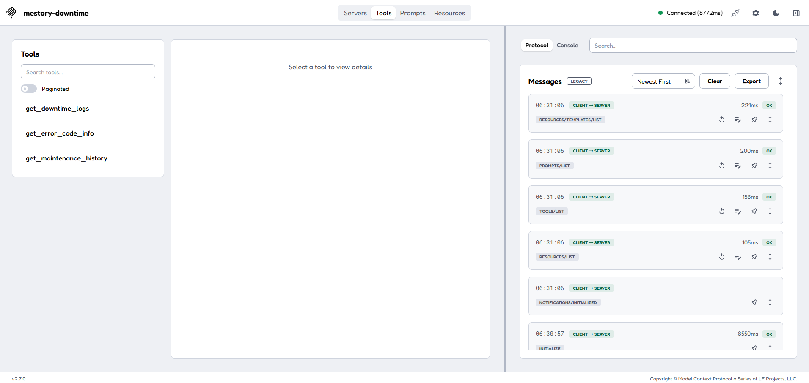
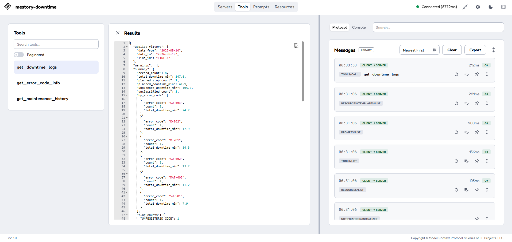
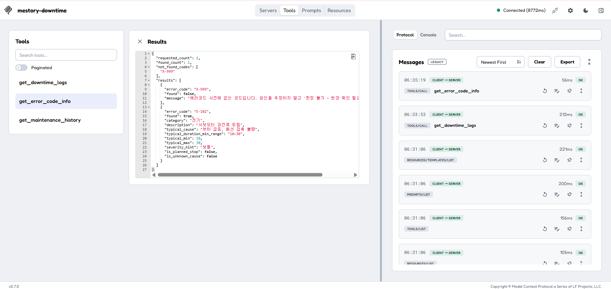

# mcp_server — MCP 조회 서버 (필수 조건 5)

담당: 박민영 (MCP · 데이터 리드)

LLM 에이전트가 정지 로그·에러코드 사전·정비이력을 조회할 수 있게 해 주는 **데이터 조회 창구**입니다.
분석·판정은 하지 않고, **사실과 주의 표시만** 돌려줍니다. (판정 규칙은 `skills/SKILL.md`)

## 도구 3개

| 도구 | 하는 일 | 필수 입력 |
| --- | --- | --- |
| `get_downtime_logs` | 조건(기간·라인·설비·코드·정지시간)에 맞는 정지 기록 + 사실 요약 + 주의 표시 | 없음 (전부 선택) |
| `get_error_code_info` | 에러코드의 뜻·흔한 원인·보통 정지시간·기본 심각도 (여러 개 한 번에) | `error_codes` |
| `get_maintenance_history` | 설비 하나의 최근 정비 기록 (기본 30일) | `equipment_id`, `reference_date` |

- 입력·출력의 자세한 규격과 합격 기준: `docs/specs/downtime-logs.md`, `error-codes.md`, `maintenance-history.md`
- 잘못된 입력은 예외를 던지지 않고 `{"error": "...", "hint": "..."}` 를 돌려줍니다. 에이전트가 읽고 고쳐서 다시 부를 수 있습니다.
- 사전에 없는 코드는 `found: false` 로 분명히 알려 줍니다. (원인을 지어내지 않게 하기 위해)

## 실행 방법

```bash
python -m mcp_server.server
```

- 아무것도 출력되지 않고 멈춰 있으면 정상입니다 (요청 대기 상태). `Ctrl+C` 로 종료.
- **반드시 `-m` 으로 실행**하세요. 파일 경로로 직접 실행하면 `from .tools ...` 상대 import 가 깨집니다.
- 통신 방식은 stdio(표준 입출력)입니다. **`print()` 로 화면에 출력하면 통신이 깨지므로 금지**입니다.

## 접근 제어

이 서버는 **stdio(표준 입출력)로만** 노출됩니다. 인터넷에 열린 주소가 없고, 백엔드가 같은 컨테이너 안에서 자식 프로세스로 띄워 쓰기 때문에 외부에서 직접 호출할 수 없습니다.
공개 `/mcp`(Streamable HTTP) endpoint 는 만들지 않았습니다 — 그쪽은 배포 담당 범위입니다.

## 백엔드에서 연결하는 방법

`backend/services/llm.py` 가 이 서버를 자식 프로세스로 띄워 `langchain-mcp-adapters` 로 도구를 불러옵니다.

```python
server_params = StdioServerParameters(
    command=sys.executable,
    args=["-m", "mcp_server.server"],
    cwd=str(REPO_ROOT),
    # 아래 env 가 없으면 DB 설정이 서버에 전달되지 않습니다 (주의 사항 참고)
    env={k: v for k in ("MESTORY_DATA_SOURCE", "DATABASE_URL", "MESTORY_DATA_DIR")
         if (v := os.getenv(k))},
)
```

> **주의**: mcp 라이브러리는 보안상 `PATH` 등 기본 환경변수만 자식 프로세스에 넘깁니다.
> `env` 를 지정하지 않으면 `DATABASE_URL` 같은 값이 서버에 전달되지 않아, DB 모드가 동작하지 않습니다.

## 데이터는 어디서 읽나 (CSV ↔ DB)

읽는 곳은 환경변수 `MESTORY_DATA_SOURCE` 로 정합니다. 바꿔도 도구 코드는 그대로입니다.

| 환경변수 | 기본값 | 설명 |
| --- | --- | --- |
| `MESTORY_DATA_SOURCE` | `csv` | `csv` = `data/` 폴더의 CSV, `db` = Postgres |
| `MESTORY_DATA_DIR` | `<저장소>/data` | CSV 폴더 위치 (CSV 모드) |
| `DATABASE_URL` / `DATABASE_PUBLIC_URL` | 없음 | Postgres 접속 주소 (DB 모드) |

- `data/` 는 `.gitignore` 라 GitHub·배포 환경에는 CSV 가 없습니다. **배포에서는 DB 모드를 쓰세요.**
- DB 에 데이터를 넣는 스크립트: `python scripts/seed_db.py` (여러 번 실행해도 중복으로 쌓이지 않음)
- DB 로 읽어도 CSV 로 읽을 때와 값·자료형이 같도록 맞췄고, `tests/test_data_loader.py` 가 이를 비교합니다.

## 확인 방법

```bash
pytest -v                      # 자동 시험 (Spec 의 합격 기준을 그대로 옮긴 것)
python ../실습/try_mcp_server.py   # 서버를 띄워 도구 목록과 호출 결과를 눈으로 확인
```

- CSV 모드: `31 passed, 4 skipped` (건너뛴 4개는 CSV↔DB 비교 — DB 주소가 있으면 실행됨)
- DB 모드: `MESTORY_DATA_SOURCE=db` + 주소를 설정하면 `35 passed`
- 데이터가 없으면 실패 대신 **건너뜀(skip)** 으로 표시됩니다.

## MCP 클라이언트에 붙여서 확인 (MCP Inspector)

도구가 실제로 불린다는 것을 확인한 기록입니다.

```bash
npx -y @modelcontextprotocol/inspector
```

브라우저가 열리면 전송 방식 `STDIO` / 명령 `python` / 인자 `-m mcp_server.server` / 작업 폴더 = 저장소 루트로 등록하고 **Connect** 하면 됩니다.
아래는 CSV 모드에서 확인한 결과입니다.

**1) 도구 3개가 등록되어 있다**



**2) 정상 조회 — 2026-08-10, LINE-A**

`record_count: 8`, `total_downtime_min: 147.6`. 계획 정지 1건(41.9분)이 총계에는 들어가되 조치 대상에서는 분리돼 나옵니다.



**3) 사전에 없는 코드 — 지어내지 않는다**

`X-999` 는 `found: false` 와 함께 *"원인을 추정하지 말고 '판정 불가 — 현장 확인 필요'로 처리하세요"* 를 돌려줍니다.
같은 호출의 `E-102` 는 뜻·표준 정지시간(10~30분)·기본 심각도를 정상적으로 돌려줍니다. **모르는 것과 아는 것이 한 화면에서 갈립니다.**



## 자주 나는 에러

| 증상 | 원인과 해결 |
| --- | --- |
| `Connection closed` (연결하자마자 끊김) | `mcp` 2.x 가 설치된 경우입니다. 2.x 에는 `mcp.server.fastmcp` 가 없습니다 → `pip install -r backend/requirements.txt` (`mcp>=1.29,<2`) |
| `데이터 파일이 없습니다: .../data/xxx.csv` | CSV 가 없는 환경입니다. `MESTORY_DATA_SOURCE=db` 로 바꾸거나 `MESTORY_DATA_DIR` 로 폴더를 지정하세요 |
| `DB 접속 주소가 없습니다` | DB 모드인데 `DATABASE_URL` 이 없습니다. 백엔드에서 띄운다면 위 `env` 전달도 확인하세요 |
| `attempted relative import` | `python mcp_server/server.py` 로 실행한 경우입니다. `python -m mcp_server.server` 로 실행하세요 |

## 폴더 구조

```
mcp_server/
├── server.py              도구 3개를 등록하는 MCP 진입점 (이름표 + 에러 처리)
└── tools/
    ├── data_loader.py     CSV 또는 DB 에서 표를 읽어 오는 창고 담당
    ├── downtime.py        정지 로그 조회·요약·주의 표시
    ├── error_codes.py     에러코드 사전 조회
    └── maintenance.py     정비이력 조회
```

## 남은 것 / 팀 확인 필요

- 4번째 도구를 추가할지 (미정)
- `/mcp` 공개 endpoint(Streamable HTTP)는 배포 담당 범위 — 여기서는 stdio 만 제공
- 배포 환경에서 DB 모드로 돌리려면: `backend/requirements.txt` 에 `psycopg[binary]` 추가, Railway 백엔드 서비스 변수에 `MESTORY_DATA_SOURCE=db` 와 `DATABASE_URL` 설정
